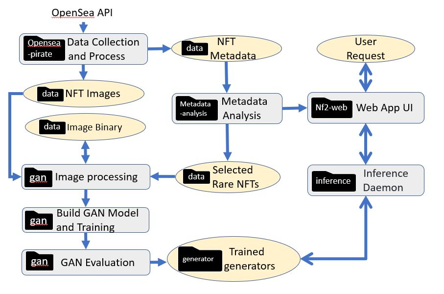

<br><br><br><br><br><br>


### Umich MADS Capstone Project Winter 2022

&nbsp;&nbsp;[Project Home](https://nf2.dev/blog) | [Web App](https://nf2.dev/) | 

> This is a capstone project for University of Michigan Master of Applied Data Science(MADS) program. <br>
The goal of this project is to explore **Non-Fungible Token (NFT)**, build a **Generative Adversarial Network (GAN)** model and train it with various NFT collections, so it can generate new NFTs in the same style as the collection. The outcome of the project is an **end-to-end web application** that enable users to generate a similar tokens through the trained GAN model.

## Quick Start

### Clone this Repository

Get a copy of source code of this project by simply running the git clone command.

``` git
git clone https://github.com/snowshine/NFTCreators.git
```

### Requirements

Before running the project, we have to install all the dependencies from requirements.txt

``` pip
pip install -r requirements.txt
```
Please note that you need a GPU to run the GAN model training. Most of the NFT collection training of this project is done through Google Colab with GPU.


## Module Relationship and Architecture

This project has four main modules: 
- data collection
    - code: opensea-pirate 
    - ouput: data
- metadata analysis 
    - code: metadata-analysis
    - input: data
    - output: data; web app
- GAN model and training 
    - code: gan
    - input: data
    - output: data, generators
- web application and token inference
    - code: inference, nf2-web
    - input: generator, metadata analysis



For details of each module please check README.md under each section.
