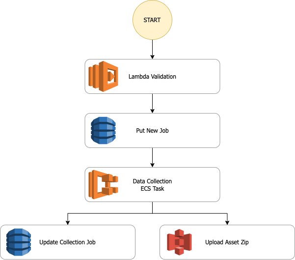
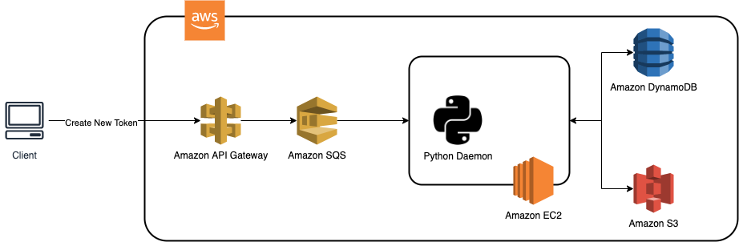

<br><br><br><br><br><br>


### Umich MADS Capstone Project Winter 2022

&nbsp;&nbsp;[project homepage](https://snowshine.github.io/NFTCreators) |  [web UI](https://nf2.dev/) |   

> This is a capstone project for University of Michigan Master of Applied Data Science program (MADS). <br>
The goal of this project is to build a **Generative Adversarial Network (GAN)** and train it with NFT collections, so it can generate new NFTs in the same style. Also, a web application is created to make our GAN available to the public.

## Quick Start

These instructions will get you a copy of the project up and running on your local machine.

### Source Code

Get a copy of source code of this project by simply running the git clone command.

``` git
git clone https://github.com/snowshine/NFTCreators.git
```

### Requirement

Before running the project, we have to install all the dependencies from requirements.txt

``` pip
pip install -r requirements.txt
```
Please note that you need a GPU to run the GAN model training. Most of the NFT collection training of this project is done through Google Colab with GPU.

### Hosting ??

Last, get the project hosted on your local machine with a single command.

``` python
python app.py
```

## Project Structure

This project has four main parts: data collection, metadata analysis, GAN model and training, web app to generate tokens from the trained model.

### Data Collection
<p align=center>
    
</p>


### Metadata Analysis


### GAN model and training
<p align=center>
    
</p>

<p align=center>
    
</p>

### Web App
<p align=center>
    
</p>
