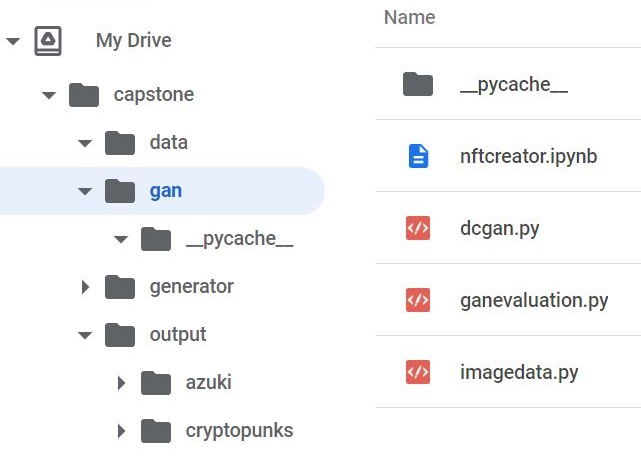
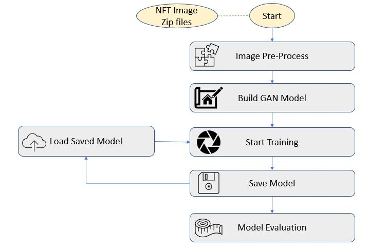

## Quick Start

This is the GAN modeling, tuning and NFT training, evaluation part of The NFT Creators capstone project.

Before running this module, we have to install all the dependencies from requirements.txt

### Requirements
``` pip
pip install -r requirements.txt
```
Please note that you need a GPU to run the GAN model training. Most of the NFT collection training of this project is done through Google Colab Pro with GPU.

### Folder Structure
Following is the example of default folder structure in Google Drive. The assumed setting is these 3 folders are in the same level: data, gan and output. you can change this through parameters.
<p align=center>
    
</p>

### Parameters
- collection: the name of the NFT collection. it specify the input data file name and output folder name
- datapath: relative path for the input data file
- outputpath: relative path for the output including saved models, loss metrics and generated images preview for each epoch
- datatype: input data file type, can be 'zip', 'npz' or 'img'
- image_shape: input and output image resolutions, support (128, 128, 3) and (32, 32, 3)
- batch_size: Tensor batch size for training. varies depending on training image resolution, dataset size, and computing environment
- startepoch: a training run starting point. "0" for initial training; otherwise it will continue training from specified epoch
- epochs: total epochs for a training run

## GAN Training Flow
<p align=center>
    
</p>

## Example Training Output


## Example Evaluation Output
