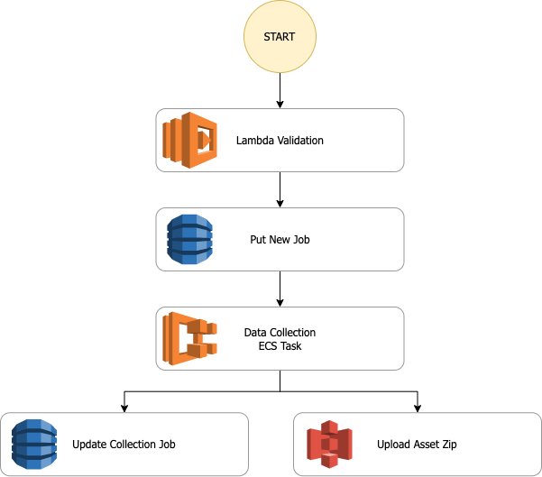

# OpenSea Pirate
## Overview
Extract the metadata and image assets of an NFT asset collection

## Data Architecture
This system uses a loosely coupled serverless infrastructure to provide a cost-effective, scalable service.

The service is orchestrated by AWS Step Functions observing the following sequential steps:
1. User provides input collection slug via API
2. A lambda validates the collection slug
3. An Amazon DynamoDB entry is created for the new job
4. An ECS task is initiated to pull all of the data
5. The task uploads a ZIP file of the image assets to Amazon S3
6. The task updates the DynamoDB entry when the task is complete with the location of the S3 ZIP file

